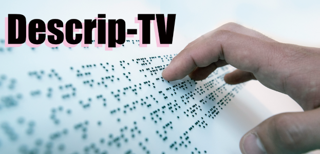
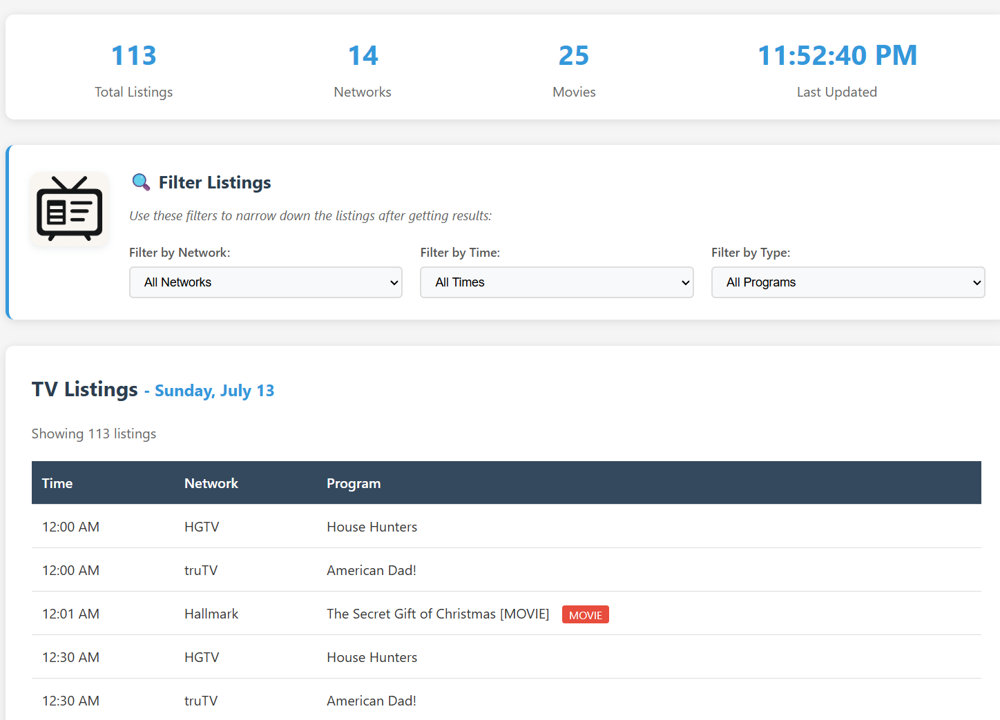
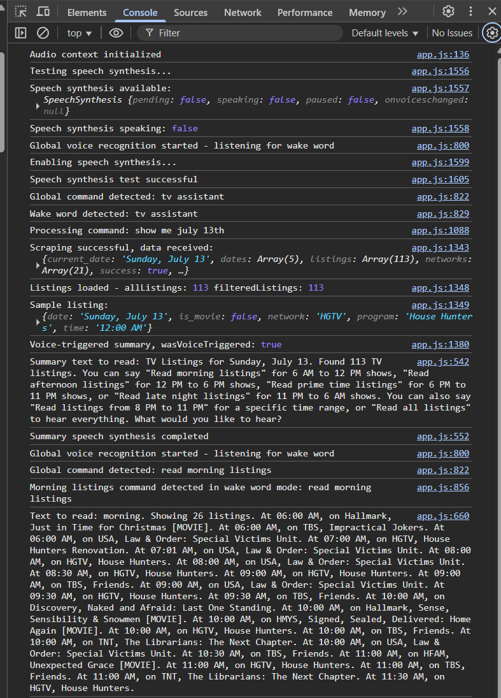

# Descrip-TV
## Audio Description TV Listings Scraper & Voice Assistant

Descrip-TV is an accessible web app that helps users—especially those who are blind or visually impaired—find and explore TV listings with audio description (a narration service that describes visual elements of TV shows and movies for blind and visually impaired viewers). The app scrapes the latest TV schedule data from the [Audio Description Project](https://adp.acb.org) and provides a modern, voice-controlled interface for searching, filtering, and reading listings aloud.



---

## Features

- **Live TV Listings Scraper:**  
  Fetches up-to-date TV listings (with audio description) for today and the next 4 days from the ADP website.

- **Voice Control & Wake Words:**  
  Hands-free operation using wake words like “Hey TV” or “TV Assistant.”  
  Natural language commands for searching, filtering, and reading listings.

- **Accessible by Design:**  
  - Large, clear visuals and high-contrast UI
  - Full keyboard navigation
  - Screen reader and speech synthesis support

- **Smart Filtering:**  
  Filter listings by network, time of day (morning, afternoon, prime time, late night), or program type (movies/series).

- **Flexible Reading:**  
  - Have listings read aloud by time period or custom time range
  - Continue, repeat, or reset reading with simple voice commands

- **Modern, Responsive UI:**  
  - Works on desktop and mobile
  - Stylish illustrations and clear instructions

---

## Demo




---

## How It Works

- **Backend:**  
  Python Flask app with a custom scraper (`scraper.py`) that extracts TV listings and metadata from the ADP website.

- **Frontend:**  
  HTML5, CSS3, and vanilla JavaScript.  
  Uses the Web Speech API for voice recognition and speech synthesis.

- **Voice Commands:**  
  Users can activate voice control, fetch listings for a specific date, filter by time/network/type, and have results read aloud—all by voice.

---

## Getting Started

### Prerequisites

- Python 3.8+
- pip

### Installation

1. **Clone the repository:**
   ```bash
   git clone https://github.com/yourusername/descrip-tv.git
   cd descrip-tv
   ```

2. **Install dependencies:**
   ```bash
   pip install -r requirements.txt
   ```

3. **Run the app:**
   ```bash
   python app.py
   ```
   The app will be available at [http://localhost:5000](http://localhost:5000).

---

## Usage

1. **Open the app in your browser.**
2. **Enable speech synthesis** if prompted (press any key or click the enable button).
3. **Say a wake word** (e.g., “Hey TV”) or click the “Voice Control” button.
4. **Ask for listings** (e.g., “Show me Friday July 11”).
5. **Use voice commands** to filter or read listings (e.g., “Read prime time listings”, “Read more listings”, “Reset”).
6. **Filter manually** using the dropdowns for network, time, or type.

---

## Voice Command Manual

Getting Started

1. **Wake Word Activation**: The app continuously listens for wake words in the background. Say any of these to activate voice control:
  
  * "TV Assistant"
  * "Voice Control"
  * "Activate Voice"
  * "Start Listening"
  * "Hey TV"
2. **Enable Speech Synthesis**: When you first visit the app, you may need to enable speech synthesis by:
  
  * Clicking the red "Enable Speech Synthesis" button in the top-left corner, OR
  * Pressing any key or tapping the screen

### Example User Flow

#### Step 1: Get TV Listings for a Specific Date

**Say:** "TV Assistant" (or any wake word)**Then say:** "Show me Friday July 11" (or any date)

**What happens:**

* The app fetches TV listings for that date
* You'll hear: "TV Listings for Friday, July 11. Found 113 TV listings. You can say 'Read morning listings' for 6 AM to 12 PM shows, 'Read afternoon listings' for 12 PM to 6 PM shows, 'Read prime time listings' for 6 PM to 11 PM shows, or 'Read late night listings' for 11 PM to 6 AM shows. You can also say 'Read shows from 8 PM to 11 PM' for a specific time range, or 'Read all listings' to hear everything. What would you like to hear?"

#### Step 2: Hear Listings by Time Period

**Say:** "Read morning listings"**What happens:** The app reads all TV shows with audio description from 6 AM to 12 PM

**Alternative commands:**

* "Read afternoon listings" (12 PM - 6 PM)
* "Read prime time listings" (6 PM - 11 PM)
* "Read late night listings" (11 PM - 6 AM)

#### Step 3: Hear Specific Time Range

**Say:** "Read shows from 7 PM to 10 PM"**What happens:** The app reads all TV shows with audio description between 7 PM and 10 PM

**Alternative formats:**

* "Read listings between 8 and 11 PM"
* "Read TV shows from 6 to 9 PM"
* "Read programs from 7 PM to 10 PM"

#### Step 4: Quick Commands (No Wake Word Needed)

**Say:** "Read again" (re-reads the last listings)**Say:** "Reset" (clears filters and shows all programs)

#### Step 5: Close Voice Control

**Say:** "Close voice" or "Stop listening"

### Natural Language Examples

The app understands various ways to phrase commands:

**Getting listings:**

* "Show me today"
* "Show me Friday July 11"
* "Show Friday July 11"
* "Show me TV listings for July 12"

**Reading listings:**

* "Read morning listings"
* "Read afternoon shows"
* "Read prime time programs"
* "Read TV shows from 7 PM to 10 PM"
* "Read listings between 8 and 11 PM"
* "Tell me what's on from 6 to 9 PM"

**Quick actions:**

* "Read again" (re-read without wake word)
* "Reset" (clear filters)
* "Close voice" (exit voice control)

### Tips for Best Results

1. **Speak clearly** and at a normal pace
2. **Use natural language** - the app understands various phrasings
3. **Be specific with times** - "7 PM to 10 PM" works better than "evening"
4. **Wait for feedback** - the app will confirm your commands
5. **Use wake words** to activate voice control, then speak your command

---

## Project Structure

```
adp-listings/
├── app.py                  # Flask app
├── scraper.py              # TV listings scraper
├── static/
│   ├── css/style.css       # Styles
│   ├── js/app.js           # Frontend logic
│   └── img/                # Images and illustrations
├── templates/
│   └── index.html          # Main HTML template
├── requirements.txt
└── README.md
```

---

## Accessibility Features

* **Hands-free operation** with wake word activation
* **Text-to-speech** reads all listings aloud
* **Natural language processing** understands various command phrasings
* **Keyboard shortcuts** (Ctrl/Cmd + V to activate voice control)
* **Screen reader compatible** with proper ARIA labels
* **High contrast** design for visual accessibility

---

## Contributing

Pull requests are welcome! For major changes, please open an issue first to discuss what you’d like to change.

---

## License

[MIT](LICENSE)

---

## Credits

- TV listings data: [Audio Description Project](https://adp.acb.org)
- Illustrations: Microsoft Designer
- Built with Flask, BeautifulSoup, and the Web Speech API

---

**Descrip-TV: Making TV listings accessible for everyone!**

---
